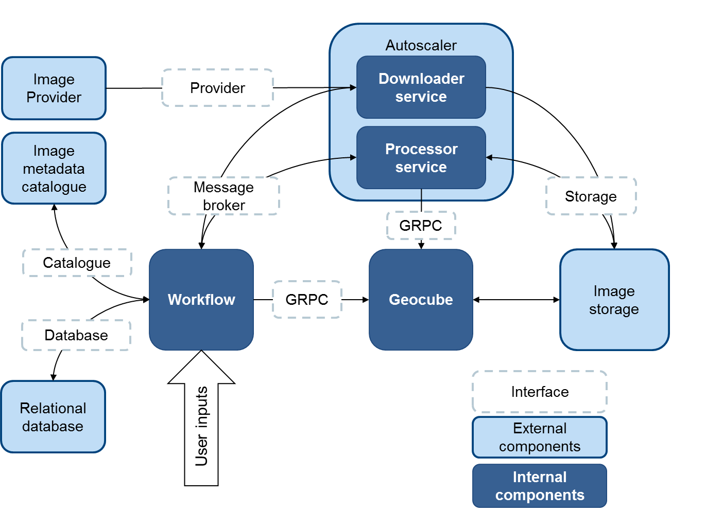

# Process and services
The Geocube Ingester is an example of a complete and parallelizable service to feed the Geocube. The user posts an AOI, a time interval and a set of parameters (to compute the output layers). The ingester takes care of everything from the downloading of the products, the computing and its parallelization and the ingestion in the Geocube.

It is composed of three services : workflow, downloader and processor. It is connected to a Geocube and has a couple of interfaces to integrate in the user environment. Some implementations of the interfaces are available and the user is free to implement others according to its environment.

## Process

The ingestion is a process in five steps:

1. List the products fitting the criteria
2. Split them in tiles (optional)
3. Create a working graph, with downloading and processing tasks
4. Download the product
5. Process, store and index them in the Geocube

## Catalogue service

The first two steps are done by a service called `Catalogue`. The goal of the first step is to find all the satellite products (`scenes`) that fit the criterias, sort them by date and group them by localisation. 

When it's relevant for preprocessing or ingestion, the `scenes` can be divided into `tiles` (e.g. S1 images can be split in bursts). This second step is not mandatory.

If it's necessary, for example to coregistrate products with the `previous` one or from a `reference`, a working graph is created where each `tile` has an ancestor (the previous product at the same location) and a reference (the first product of the timeserie at the same location). Nevertheless, this working graph can only be executed when the `tiles` are on the same grid (e.g. granules for S2, bursts for S1... ), hence the interest to use a common grid to divide the scenes into tiles.

The `catalogue` service is usually managed by the `workflow service`, but it can be standalone.

The `catalogue` service is connected to a Geocube to get, check or record some information to prepare the indexation.

## Workflow service

The `workflow service` is responsible for the orchestration of the downloading and processing tasks. It is connected to a database that contains all the current and past tasks. 

Each task has :

- An ID and a name
- A status (NEW, PENDING, DONE, RETRY, FAILED)
- A message (that is especially used to report errors)
- (Processing tasks only): a reference and a previous Task

A processing task is sent to the processing service as soon as its reference and previous tasks are either null, DONE or FAILED.

The downloading or processing orders are emitted automatically to the corresponding service through a messaging service.

As downloading a product and processing it are two tasks that have not the same requirements in term of CPU, memory, bandwidth, they are executed by two different services.

## Downloader service

The `downloader service`:

- has connections to several external providers of images
- has appropriate rights to store images in a local or near storage.
- pulls downloading tasks from the messaging service and process them :

    1. Download the scenes from several [providers](../user-guide/providers.md). When a list of providers is available, the downloader tries them one by one until the product is found. 
    2. Split the scenes in tiles (if necessary) according to a [processing graph](../user-guide/graph.md).
    3. Upload the tiles on a local or near storage.

- sent the result (success or failure) to the workflow service through a messaging service.

## Processor service

The `processor service`:

- is connected to the Geocube Server (to index the layers processed)
- has appropriate rights to read images from the local or near storage (the one where the products are downloader)
- has appropriate rights to write images on a store reachable by the Geocube Server.
- pulls processing tasks from the messaging service and processes them:
    1. Get the tiles from the local storage and process them to as many layers as required, according to a [processing graph](../user-guide/graph.md).
    2. Upload the output layers to a storage accessible by the Geocube
    3. Index the output layers in the Geocube
    4. Clean the temporary files that are stored in the local or near storage

- sent the result (success or failure) to the workflow service through a messaging service.
