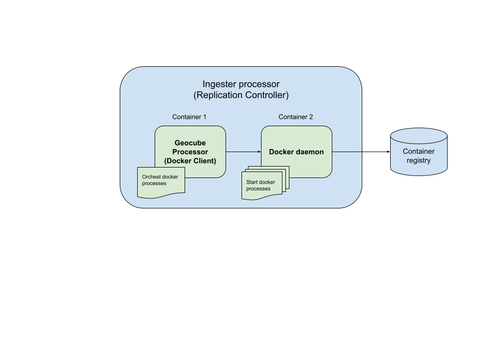

# Graph

## Principle

A processing graph defines a sequence of [steps](graph.md#steps) which will be executed on the input images. 

Each step is a command with parameters and [configurations](graph.md#config). A logical [condition](graph.md#condition) can be added to the execution of the step.

Each step is executed with an `engine` among `Python`, `Snap`, `cmd` and `Docker`.

Graph should have [input](graph.md#input-files) or/and [output](graph.md#output-files) files (depends on kind of processing).

## JSON Graph

### Structure

```go
type ProcessingGraphJSON struct {
    Config   map[string]string `json:"config"`
    Envs     []string          `json:"envs,omitempty"`
    InFiles  [3][]InFile       `json:"in_files"`
    OutFiles [][]OutFile       `json:"out_files"`
    Steps    []ProcessingStep  `json:"processing_steps"`
}
```

### Config

List of configuration values that can be used as parameters of a `Command`, using `ArgConfig` structure (see [Args](#args)).


### Files

A file is defined by its name (`Layer` field) and its `Extension` (it must be consistent between the `scene graph` and the `tile graph`).

##### Examples of Layer name

```go
const (
	  Product     Layer = "__product__"     // Special value, that will be replaced by the SourceID of the Scene
	  Annotations Layer = "__annotations__" // Special value, that will be replaced by the SourceID of the Scene + "_annotations" suffix
    
    LayerPreprocessed  Layer = "preprocessed"
    LayerCoregistrated Layer = "coregistred"
    LayerCoregExtract  Layer = "coregextract"
    LayerCoherence     Layer = "coherence"
    
    LayerBackscatterVV Layer = "sigma0_VV"
    LayerBackscatterVH Layer = "sigma0_VH"
    LayerCoherenceVV   Layer = "coh_VV"
    LayerCoherenceVH   Layer = "coh_VH"
    LayerPanchromatic  Layer = "P"
    LayerMultiSpectral Layer = "MS"
)
```

##### Examples of File Extension

```go
const (
	NoExtension    Extension = "" // The layer has no extension
	ExtensionGTiff Extension = "tif"
	ExtensionZIP   Extension = "zip"
	// The following extensions are directories, thus, they are stored as a zip file (see service.storeAsZip() function)
	// Using those extensions ensures that the stored files will be unzipped in a directory named <layer>.<Extension>
	ExtensionSAFE      Extension = "SAFE" // Sentinel product
	ExtensionDIMAP     Extension = "dim"
	ExtensionDIMAPData Extension = "data"
	ExtensionAll       Extension = "*" // The content of the whole working directory (e.g. useful to export all the downloaded files as one zip file). Replaced by NoExtension in the directory name
)
```
#### Input Files

> For the processor graph file only

`InFile` defines a file used in input of the processing. It can be either a `product` that has just be downloaded by the `downloader` or a list of `Layer` that will be processed by the `processor`.

The files defined in `InFile` are automatically downloaded from the storage and stored locally during the processing.

##### Structure

```go
// InFile describes an input file of the processing
type InFile struct {
	File
	Condition TileCondition `json:"condition"`
}
```

##### Example

To use the whole product as input
```json
{
   "in_files":[
      [
         {
            "layer":"__product__",
            "extension":"SAFE"
         }
      ],
      [],
      []
   ]
}

To use a specitic layer that has been preprocessed by the downloader:
```json
{
   "in_files":[
      [
         {
            "layer":"coregistrated",
            "extension":"tif"
         }
      ],
      [],
      []
   ]
}
```

Infiles json block is an array of 3. The first value is always relative to the current product. The second and third values can be used to reference other products, such as the previous in the timeserie or the first of the timeserie (e.g: to have a unique reference for all the images in the timeserie). For instance, it is useful in order to process coherence cf. [Example with S1](graph.md#example-processing-sentinel1)

#### Output Files

`OutFile` defines a file (name (`Layer`) and extension) generated by the processing steps. Output files can be stored in the storage, indexed in the geocube (for `processor` only), or flagged as to be deleted.

If an `OutFile` is to be indexed in the Geocube, the following information must be provided (for other action, they will be ignored):
- `DType`
- `NoData`
- `Min`, `Max`
- `ExtMin`, `ExtMax`
- `Exponent`
- `Nbands`

See geocube indexation documentation for further information.


##### Structure

```go
// OutFile describes an output file of the processing
type OutFile struct {
	File
	dformatOut Arg           // argFixed or argConfig
	DType      DType         `json:"datatype"`
	NoData     float64       `json:"nodata"`
	Min        float64       `json:"min_value"`
	Max        float64       `json:"max_value"`
	ExtMin     float64       `json:"ext_min_value"`
	ExtMax     float64       `json:"ext_max_value"`
	Exponent   float64       `json:"exponent"` // JSON default: 1
	Nbands     int           `json:"nbands"`   // JSON default: 1
	Action     OutFileAction `json:"action"`
	Condition  TileCondition `json:"condition"` // JSON default: pass
}
```

##### Available action

```go
// OutFileAction
const (
	ToIgnore OutFileAction = iota `json:"to_ignore"`
	ToCreate                      `json:"to_create"`
	ToIndex                       `json:"to_index"`
	ToDelete                      `json:"to_delete"`
)
```

##### Example

```json
{
   "out_files":[
      [
         {
            "layer":"img",
            "extension":"tif",
            "action":"to_index",
            "dformat_out":{
               "type":"fixed",
               "value":"uint16,0,0,30000"
            },
            "ext_min_value":0,
            "ext_max_value":3,
            "nbands":4
         },
         {
            "layer":"clcsh",
            "extension":"tif",
            "action":"to_create",
         },
         {
            "layer":"__product__",
            "extension":"SAFE",
            "action":"to_delete",
            "error_condition": "on_fatal_failure"
         }
      ],
      [],
      []
   ]
}
```

### Steps

List of processing steps that will be executed sequentially.

#### Engine

Define the kind of engine that will be used to execute the step.

Available engines:

- Snap: for Sentinel constellation (if installed)
- Python: to execute python script
- Docker: to run a docker
- Cmd: for command available in the docker

#### Command

Define the command to execute with the given engine.

MyBinary Example:

```json
{
  "processing_steps": [
    {
      "engine": "cmd",
      "command": "./cmd/MyBinary"
    }
  ]
}
```

Docker Example:

```json
{
  "engine": "docker",
  "command": "containerRegistry/myImage:myTag"
}
```

#### Args

List of arguments that will be passed to the command, with the following synthax : `--argument-name argument-value`.

They can be of five types:

- `ArgIn`: The path of the file corresponding to a layer in `InFiles`.
- `ArgOut`: The path of the file corresponding to a layer in `OutFiles`.
- `ArgFixed`: A fixed value
- `ArgConfig`: A value retrieved from the `Config` using a key. The key `workdir` is defined at runtime to point to the working directory.
- `ArgTile`: A value retrieved from the tile. Supported value:
  - `constellation`
  - `scene` name
  - `date`
	- `number`: tile number (for Sentinel-1: =burst number)
	- `swath` (Sentinel-1)
	- `cohdate`: (Sentinel-1) Date of the reference burst if different from previous date or date of the burst


##### Structure:

```go
type ArgIn struct {
	Input     int               `json:"tile_index"` // Index of input [0, 1, 2]
	Layer     service.Layer     `json:"layer"`
	Extension service.Extension `json:"extension"`
}

type ArgOut struct { 
    service.Layer `json:"layer"`
    Extension     service.Extension `json:"extension"`
}

type ArgFixed string  // fixed arg
type ArgConfig string // arg from config
type ArgTile string   // arg from tile info
```

##### Example

```json
{
  "engine":"docker",
  "command":"containerRegistry/myImage:myTag",
  "args":{
    "workdir":{
      "type":"config",
      "value":"workdir"
    },
    "image-in":{
      "type":"in",
      "layer":"__product__",
      "extension":"SAFE"
    },
    "parameter-from-config":{
      "type":"config",
      "value":"key-in-config"
    },
    "constellation":{
      "type":"fixed",
      "value":"sentinel2"
    },
    "out-file":{
      "type":"out",
      "layer":"img",
      "extension":"tif"
    },
    "out-pattern":{
      "type":"out",
      "layer":"*",
      "extension":"tif"
    }
  }
}
```

This step will run something similar to:

`docker run -v <volume>:<workdir> containerRegistry/myImage:myTag --workdir <config['workdir']> --image-in <path to in_file[0]/product.SAFE> --parameter-from-config <config['key-in-config']> --constellation sentinel2 --out-file <path to out_file[0]/img.tif> --out-pattern <path to out_file[0]>/*.tif`

#### Condition

Condition to optionally execute the step.

##### Structure

```go
type TileCondition struct {
	Name string
	Pass func([]common.Tile) bool
}
```

##### Available tileConditions

```go
// condPass is a tileCondition always true
var pass = TileCondition{"pass", func(tiles []common.Tile) bool { return true }}

// condDiffTile returns true if tile1 != tile2
var condDiffT0T1 = TileCondition{"different_T0_T1", func(tiles []common.Tile) bool { return tiles[0].Scene.SourceID != tiles[1].Scene.SourceID }}
var condDiffT0T2 = TileCondition{"different_T0_T2", func(tiles []common.Tile) bool { return tiles[0].Scene.SourceID != tiles[2].Scene.SourceID }}
var condDiffT1T2 = TileCondition{"different_T1_T2", func(tiles []common.Tile) bool { return tiles[1].Scene.SourceID != tiles[2].Scene.SourceID }}

// condEqualTile returns true if tile1 == tile2
var condEqualT0T1 = TileCondition{"equal_T0_T1", func(tiles []common.Tile) bool { return tiles[0].Scene.SourceID == tiles[1].Scene.SourceID }}
var condEqualT0T2 = TileCondition{"equal_T0_T2", func(tiles []common.Tile) bool { return tiles[0].Scene.SourceID == tiles[2].Scene.SourceID }}
var condEqualT1T2 = TileCondition{"equal_T1_T2", func(tiles []common.Tile) bool { return tiles[1].Scene.SourceID == tiles[2].Scene.SourceID }}
```

##### Example
```json
{
  "condition": "pass"
}
```

### Example Processing Sentinel1

```json
{
  "config": {
    "bs_erode_iterations": "10",
    "coh_erode_iterations": "10",
    "coherence_azimuth": "4",
    "coherence_range": "16",
    "dem_egm_correction": "True",
    "dem_file": "",
    "dem_name": "SRTM 3Sec",
    "dem_nodata": "0",
    "dem_resampling": "BILINEAR_INTERPOLATION",
    "dformat_out": "float32,0,0,1",
    "img_resampling": "BICUBIC_INTERPOLATION",
    "bkg_resampling": "BISINC_21_POINT_INTERPOLATION",
    "projection": "EPSG:4326",
    "resolution": "20",
    "snap_cpu_parallelism": "1",
    "terrain_correction_azimuth": "1",
    "terrain_correction_range": "4"
  },
  "processing_steps": [
    {
      "engine": "snap",
      "command": "snap/S1_SLC_BkG.xml",
      "args": {
        "dem_file": { "type": "config", "value": "dem_file" },
        "dem_name": { "type": "config", "value": "dem_name" },
        "dem_nodata": { "type": "config", "value": "dem_nodata" },
        "dem_resampling": { "type": "config", "value": "dem_resampling" },
        "resampling": { "type": "config", "value": "bkg_resampling" },
        "master": { "type": "in", "tile_index": 2, "layer": "preprocessed", "extension": "dim" },
        "output": { "type": "out", "layer": "coregistred", "extension": "dim" },
        "slave": { "type": "in", "tile_index": 0, "layer": "preprocessed", "extension": "dim" }
      },
      "condition": "pass"
    },
    {
      "engine": "snap",
      "command": "snap/S1_SLC_SlvExtract.xml",
      "args": {
        "input": { "type": "in", "tile_index": 0, "layer": "coregistred", "extension": "dim" },
        "output": { "type": "out", "layer": "coregextract", "extension": "dim" }
      },
      "condition": "different_T0_T1"
    },
    {
      "engine": "snap",
      "command": "snap/S1_SLC_Deb_BetaSigma_ML_TC_RNKELL.xml",
      "args": {
        "azimuth_multilook": { "type": "config", "value": "terrain_correction_azimuth" },
        "band": { "type": "fixed", "value": "Sigma0" },
        "dem_egm": { "type": "config", "value": "dem_egm_correction" },
        "dem_file": { "type": "config", "value": "dem_file" },
        "dem_name": { "type": "config", "value": "dem_name" },
        "dem_nodata": { "type": "config", "value": "dem_nodata" },
        "dem_resampling": { "type": "config", "value": "dem_resampling" },
        "grid_align": { "type": "fixed", "value": "true" },
        "img_resampling": { "type": "config", "value": "img_resampling" },
        "img_suffix": { "type": "tile", "value": "date" },
        "input": { "type": "in", "tile_index": 0, "layer": "coregistred", "extension": "dim" },
        "outputVH": { "type": "out", "layer": "sigma0_VH", "extension": "tif" },
        "outputVV": { "type": "out", "layer": "sigma0_VV", "extension": "tif" },
        "projection": { "type": "config", "value": "projection" },
        "range_multilook": { "type": "config", "value": "terrain_correction_range" },
        "resolution": { "type": "config", "value": "resolution" },
        "swath": { "type": "tile", "value": "swath" },
        "trig": { "type": "fixed", "value": "sin" }
      },
      "condition": "pass"
    },
    {
      "engine": "python",
      "command": "python/erodeMask.py",
      "args": {
        "file-in": { "type": "out", "layer": "sigma0_VV", "extension": "tif" },
        "file-out": { "type": "out", "layer": "sigma0_VV", "extension": "tif" },
        "iterations": { "type": "config", "value": "bs_erode_iterations" },
        "no-data": { "type": "fixed", "value": "0" }
      },
      "condition": "pass"
    },
    {
      "engine": "python",
      "command": "python/convert.py",
      "args": {
        "dformat-out": { "type": "config", "value": "dformat_out" },
        "file-in": { "type": "out", "layer": "sigma0_VV", "extension": "tif" },
        "file-out": { "type": "out", "layer": "sigma0_VV", "extension": "tif" },
        "range-in": { "type": "fixed", "value": "0,1" }
      },
      "condition": "pass"
    },
    {
      "engine": "python",
      "command": "python/erodeMask.py",
      "args": {
        "file-in": { "type": "out", "layer": "sigma0_VH", "extension": "tif" },
        "file-out": { "type": "out", "layer": "sigma0_VH", "extension": "tif" },
        "iterations": { "type": "config", "value": "bs_erode_iterations" },
        "no-data": { "type": "fixed", "value": "0" }
      },
      "condition": "pass"
    },
    {
      "engine": "python",
      "command": "python/convert.py",
      "args": {
        "dformat-out": { "type": "config", "value": "dformat_out" },
        "file-in": { "type": "out", "layer": "sigma0_VH", "extension": "tif" },
        "file-out": { "type": "out", "layer": "sigma0_VH", "extension": "tif" },
        "range-in": { "type": "fixed", "value": "0,1" }
      },
      "condition": "pass"
    },
    {
      "engine": "snap",
      "command": "snap/S1_SLC_BkG.xml",
      "args": {
        "dem_file": { "type": "config", "value": "dem_file" },
        "dem_name": { "type": "config", "value": "dem_name" },
        "dem_nodata": { "type": "config", "value": "dem_nodata" },
        "dem_resampling": { "type": "config", "value": "dem_resampling" },
        "resampling": { "type": "config", "value": "bkg_resampling" },
        "master": { "type": "in", "tile_index": 0, "layer": "coregextract", "extension": "dim" },
        "output": { "type": "out", "layer": "coregistred", "extension": "dim" },
        "slave": { "type": "in", "tile_index": 1, "layer": "coregextract", "extension": "dim" }
      },
      "condition": "different_T1_T2"
    },
    {
      "engine": "snap",
      "command": "snap/S1_SLC_Coh_BSel_Deb_ML_TC.xml",
      "args": {
        "azimuth_multilook": { "type": "config", "value": "terrain_correction_azimuth" },
        "coherence_azimuth": { "type": "config", "value": "coherence_azimuth" },
        "coherence_range": { "type": "config", "value": "coherence_range" },
        "dem_egm": { "type": "config", "value": "dem_egm_correction" },
        "dem_file": { "type": "config", "value": "dem_file" },
        "dem_name": { "type": "config", "value": "dem_name" },
        "dem_nodata": { "type": "config", "value": "dem_nodata" },
        "dem_resampling": { "type": "config", "value": "dem_resampling" },
        "grid_align": { "type": "fixed", "value": "true" },
        "img_resampling": { "type": "config", "value": "img_resampling" },
        "input": { "type": "in", "tile_index": 0, "layer": "coregistred", "extension": "dim" },
        "outputVH": { "type": "out", "layer": "coh_VH", "extension": "tif" },
        "outputVV": { "type": "out", "layer": "coh_VV", "extension": "tif" },
        "projection": { "type": "config", "value": "projection" },
        "range_multilook": { "type": "config", "value": "terrain_correction_range" },
        "resolution": { "type": "config", "value": "resolution" },
        "sel_date": { "type": "tile", "value": "cohdate" }
      },
      "condition": "different_T0_T1"
    },
    {
      "engine": "python",
      "command": "python/erodeMask.py",
      "args": {
        "file-in": { "type": "out", "layer": "coh_VV", "extension": "tif" },
        "file-out": { "type": "out", "layer": "coh_VV", "extension": "tif" },
        "iterations": { "type": "config", "value": "coh_erode_iterations" },
        "no-data": { "type": "fixed", "value": "0" }
      },
      "condition": "different_T0_T1"
    },
    {
      "engine": "python",
      "command": "python/convert.py",
      "args": {
        "dformat-out": { "type": "config", "value": "dformat_out" },
        "file-in": { "type": "out", "layer": "coh_VV", "extension": "tif" },
        "file-out": { "type": "out", "layer": "coh_VV", "extension": "tif" },
        "range-in": { "type": "fixed", "value": "0,1" }
      },
      "condition": "different_T0_T1"
    },
    {
      "engine": "python",
      "command": "python/erodeMask.py",
      "args": {
        "file-in": { "type": "out", "layer": "coh_VH", "extension": "tif" },
        "file-out": { "type": "out", "layer": "coh_VH", "extension": "tif" },
        "iterations": { "type": "config", "value": "coh_erode_iterations" },
        "no-data": { "type": "fixed", "value": "0" }
      },
      "condition": "different_T0_T1"
    },
    {
      "engine": "python",
      "command": "python/convert.py",
      "args": {
        "dformat-out": { "type": "config", "value": "dformat_out" },
        "file-in": { "type": "out", "layer": "coh_VH", "extension": "tif" },
        "file-out": { "type": "out", "layer": "coh_VH", "extension": "tif" },
        "range-in": { "type": "fixed", "value": "0,1" }
      },
      "condition": "different_T0_T1"
    }
  ],
  "in_files": [
    [
      {
        "layer": "preprocessed",
        "extension": "dim"
      }
    ],
    [
      {
        "layer": "coregextract",
        "extension": "dim",
        "condition": "different_T1_T2"
      }
    ],
    [
      {
        "layer": "preprocessed",
        "extension": "dim",
        "condition": "different_T0_T2"
      }
    ]
  ],
  "out_files": [
    [
      {
        "layer": "sigma0_VV",
        "extension": "tif",
        "dformat_out": { "type": "config", "value": "dformat_out" },
        "ext_min_value": 0,
        "ext_max_value": 1,
        "action": "to_index"
      },
      {
        "layer": "sigma0_VH",
        "extension": "tif",
        "dformat_out": { "type": "config", "value": "dformat_out" },
        "ext_min_value": 0,
        "ext_max_value": 1,
        "action": "to_index"
      },
      {
        "layer": "coh_VV",
        "extension": "tif",
        "dformat_out": { "type": "config", "value": "dformat_out" },
        "ext_min_value": 0,
        "ext_max_value": 1,
        "action": "to_index",
        "condition": "different_T0_T1"
      },
      {
        "layer": "coh_VH",
        "extension": "tif",
        "dformat_out": { "type": "config", "value": "dformat_out" },
        "ext_min_value": 0,
        "ext_max_value": 1,
        "action": "to_index",
        "condition": "different_T0_T1"
      }
    ],
    [
    ],
    []
  ]
}
```

### Example Processing Sentinel2

```json
{
    "config": {
      "srtm-uri": "..."
    },
    "processing_steps": [
     {
      "engine": "cmd",
      "command": "./cmd/radiometric_processor",
      "args": {
        "workdir": { "type": "config", "value": "workdir" },
        "image": { "type": "in", "layer": "__product__", "extension": "SAFE" },
        "srtm-uri": { "type": "config", "value": "srtm-uri" },
        "constellation": { "type": "fixed", "value": "sentinel2" },
        "out-pattern": { "type": "out", "layer": "*", "extension": "tif" }
      },
      "condition": "pass"
     },
     {
      "engine": "cmd",
      "command": "./cmd/registation",
      "args": {
        "workdir": { "type": "config", "value": "workdir" },
        "satellite-image": { "type": "in", "layer": "__product__", "extension": "SAFE" },
        "input": { "type": "fixed", "value": "*.tif"},
        "output": { "type": "fixed", "value": "." },
        "constellation": { "type": "fixed", "value": "Sentinel2" }
      },
      "condition": "pass"
     }
    ],
    "in_files": [
     [
      {
        "layer": "__product__",
        "extension": "SAFE"
      }
     ],
     [],
     []
    ],
    "out_files": [
     [
      {
        "layer": "img",
        "extension": "tif",
        "action": "to_index",
        "dformat_out": { "type": "fixed", "value": "uint16,0,0,30000" },
        "ext_min_value": 0,
        "ext_max_value": 3,
        "nbands": 4
      },
      {
        "layer": "quality_mask",
        "extension": "tif",
        "action": "to_index",
        "dformat_out": { "type": "fixed", "value": "int16,-1,0,10000" },
        "ext_min_value": 0,
        "ext_max_value": 1
      }
     ],
     [],
     []
    ]
   }
   
```


## Docker Engine


### Principle & Concept

Instead of using and runing one large image docker which contains every dependencies (Snap, Python, other binaries), the ingester processor can be a docker container orchestrator.



Processor Replication controller can be configured to run two containers:

* Generic container with processor Go binary and docker binary (Client)
* Dind (docker in docker) container which contains docker daemon (Server)

### Deployment

In order to deploy this kind of architecture, some configuration must be added in your k8s config file:

In client container (environment var):

```kubernetes
- name: DOCKER_HOST
  value: tcp://localhost:2375
```

A certificate can be defined in order to secure your server or enable insecure trafic.

In Server container (environment var):

```kubernetes
- name: DOCKER_TLS_CERTDIR
  value: ""
```

### Private Registry

In order to use private registry, credentials must be configured in Client side container.

* user (for gcp registry: `_json_key`)
* password (for gcp registry: service account content)
* server (for gcp registry e.g: `https://europe-west1-docker.pkg.dev`)

For images stored in public registry (ex. docker.hub), there is no need for credentials.

### Credentials

Some containers need file credentials (to request storage for example).

`docker-mount-volumes` can be defined in client executable arguments to mount a volume containing credential file.

Variable environment must be also defined in graph file:

```json
{
      "engine": "docker",
      "command": "myImage",
      "args": {
        "workdir": { "type": "config", "value": "workdir" },
        "image": { "type": "in", "layer": "__product__", "extension": "SAFE" },
        "srtm-uri": { "type": "config", "value": "srtm-uri" },
        "roadmap": { "type": "config", "value": "roadmap-robot" },
        "options": { "type": "config", "value": "roadmap-options" },
        "roadmap-params": { "type": "config", "value": "roadmap-params" },
        "libs": { "type": "config", "value": "libs" },
        "constellation": { "type": "fixed", "value": "sentinel2" },
        "out-pattern": { "type": "out", "layer": "*", "extension": "tif" }
      },
      "envs": ["GOOGLE_APPLICATION_CREDENTIALS=/myPath/myFile"],
      "condition": "pass"
}
```

Important: Path defined in args and path in graphFile should be equal.

### Volume

In order to mount volume correctly, it is important to enable access to all containers (processor & docker-daemon)

Example:

- If you want to use a `workdir` which is mount on `/local-sdd` in your processor kubernetes deployment.

- If you want to mount also this `workdir` on your docker processing, you need to mount this volume on processor container and docker-dind container to enable docker-daemon access.
