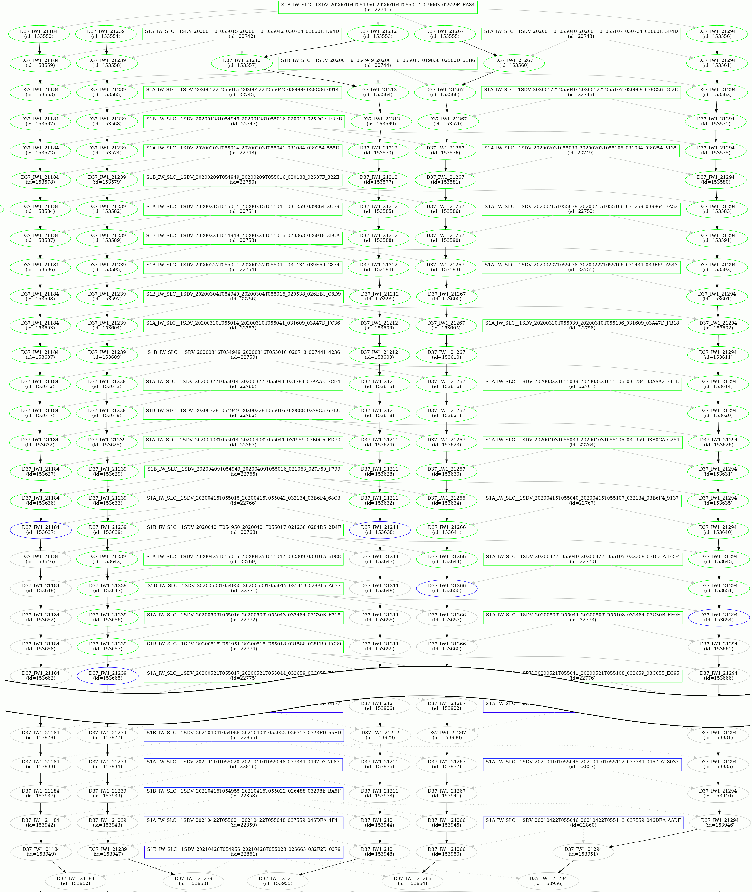

# Monitoring

To monitor an ingestion, the workflow server provides several endpoints.

## Endpoints

### AOI

- `POST /aoi/{aoi}`: create a new AOI
- `POST /aoi/{aoi}/scene`: add a new scene and its tiles to the graph of dependencies
- `PUT /aoi/{aoi}/retry`: retry all the scenes and tiles of the AOI (iif Status=RETRY)
- `GET /aoi/{aoi}`: overview of the workload for an AOI
- `GET /aoi/{aoi}/dot`: Pretty display of the workflow

Ex:



### Scenes

Monitoring endpoints concerning Scenes are returned in GeoJSON Format.

We can found a lot of information such as geometry, product tags and payload information.

- `GET /aoi/{aoi}/scenes`: list Scenes of an AOI

Ex:

```json
{
   "type":"FeatureCollection",
   "features":[
      {
         "type":"Feature",
         "id":0,
         "geometry":{
            "type":"Polygon",
            "coordinates":[
               [
                  [
                     9.198432,
                     54.109722
                  ],
                  [
                     13.150673,
                     54.52261
                  ],
                  [
                     12.719638,
                     56.140678
                  ],
                  [
                     8.601999,
                     55.722992
                  ],
                  [
                     9.198432,
                     54.109722
                  ]
               ]
            ]
         },
         "properties":{
            "GeometryWKT":"MULTIPOLYGON (((9.198432 54.109722, 13.150673 54.52261, 12.719638 56.140678, 8.601999 55.722992, 9.198432 54.109722)))",
            "Ingested":false,
            "OwnRecord":false,
            "ProductName":"S1A_IW_SLC__1SDV_20220204T170123_20220204T170150_041766_04F863_",
            "Tags":{
               "area":"Denmark",
               "constellation":"SENTINEL1",
               "ingestionDate":"2022-02-04T18:12:29.14Z",
               "lastOrbit":"41766",
               "lastRelativeOrbit":"44",
               "orbit":"41766",
               "orbitDirection":"ASCENDING",
               "polarisationMode":"VV VH",
               "productType":"SLC",
               "provider":"geocube-ingester",
               "relativeOrbit":"44",
               "satellite":"SENTINEL1A",
               "sliceNumber":"17",
               "source":"tutorial",
               "sourceID":"S1A_IW_SLC__1SDV_20220204T170123_20220204T170150_041766_04F863_D5BE",
               "uuid":"d82774b2-b84a-4a90-a499-94e68f92abeb"
            },
            "Tiles":null,
            "aoi":"DenmarkDemo",
            "data":{
               "date":"2022-02-04T17:01:23.133Z",
               "graph_config":{
                  "bkg_resampling":"BISINC_5_POINT_INTERPOLATION",
                  "projection":"EPSG:32632",
                  "snap_cpu_parallelism":"8"
               },
               "graph_name":"S1Preprocessing",
               "instances_id":null,
               "record_id":"",
               "tiles":{
                  
               },
               "uuid":"d82774b2-b84a-4a90-a499-94e68f92abeb"
            },
            "id":0,
            "source_id":"S1A_IW_SLC__1SDV_20220204T170123_20220204T170150_041766_04F863_D5BE"
         }
      },
      {
         "type":"Feature",
         "id":1,
         "geometry":{
            "type":"Polygon",
            "coordinates":[
               [
                  [
                     9.197865,
                     54.109722
                  ],
                  [
                     13.150205,
                     54.52264
                  ],
                  [
                     12.719013,
                     56.141193
                  ],
                  [
                     8.601213,
                     55.723476
                  ],
                  [
                     9.197865,
                     54.109722
                  ]
               ]
            ]
         },
         "properties":{
            "GeometryWKT":"MULTIPOLYGON (((9.197865 54.109722, 13.150205 54.52264, 12.719013 56.141193, 8.601213 55.723476, 9.197865 54.109722)))",
            "Ingested":false,
            "OwnRecord":false,
            "ProductName":"S1A_IW_SLC__1SDV_20220123T170123_20220123T170150_041591_04F274_",
            "Tags":{
               "area":"Denmark",
               "constellation":"SENTINEL1",
               "ingestionDate":"2022-01-23T18:36:49.532Z",
               "lastOrbit":"41591",
               "lastRelativeOrbit":"44",
               "orbit":"41591",
               "orbitDirection":"ASCENDING",
               "polarisationMode":"VV VH",
               "productType":"SLC",
               "provider":"geocube-ingester",
               "relativeOrbit":"44",
               "satellite":"SENTINEL1A",
               "sliceNumber":"17",
               "source":"tutorial",
               "sourceID":"S1A_IW_SLC__1SDV_20220123T170123_20220123T170150_041591_04F274_1609",
               "uuid":"dd3ed568-eb45-4509-be30-de2ac4e106b5"
            },
            "Tiles":null,
            "aoi":"DenmarkDemo",
            "data":{
               "date":"2022-01-23T17:01:23.721Z",
               "graph_config":{
                  "bkg_resampling":"BISINC_5_POINT_INTERPOLATION",
                  "projection":"EPSG:32632",
                  "snap_cpu_parallelism":"8"
               },
               "graph_name":"S1Preprocessing",
               "instances_id":null,
               "record_id":"",
               "tiles":{
                  
               },
               "uuid":"dd3ed568-eb45-4509-be30-de2ac4e106b5"
            },
            "id":0,
            "source_id":"S1A_IW_SLC__1SDV_20220123T170123_20220123T170150_041591_04F274_1609"
         }
      },
      {
         "type":"Feature",
         "id":2,
         "geometry":{
            "type":"Polygon",
            "coordinates":[
               [
                  [
                     9.197315,
                     54.109573
                  ],
                  [
                     13.149646,
                     54.522511
                  ],
                  [
                     12.718431,
                     56.14106
                  ],
                  [
                     8.600642,
                     55.723324
                  ],
                  [
                     9.197315,
                     54.109573
                  ]
               ]
            ]
         },
         "properties":{
            "GeometryWKT":"MULTIPOLYGON (((9.197315 54.109573, 13.149646 54.522511, 12.718431 56.14106, 8.600642 55.723324, 9.197315 54.109573)))",
            "Ingested":false,
            "OwnRecord":false,
            "ProductName":"S1A_IW_SLC__1SDV_20220111T170124_20220111T170151_041416_04ECAD_",
            "Tags":{
               "area":"Denmark",
               "constellation":"SENTINEL1",
               "ingestionDate":"2022-01-11T18:12:30.031Z",
               "lastOrbit":"41416",
               "lastRelativeOrbit":"44",
               "orbit":"41416",
               "orbitDirection":"ASCENDING",
               "polarisationMode":"VV VH",
               "productType":"SLC",
               "provider":"geocube-ingester",
               "relativeOrbit":"44",
               "satellite":"SENTINEL1A",
               "sliceNumber":"17",
               "source":"tutorial",
               "sourceID":"S1A_IW_SLC__1SDV_20220111T170124_20220111T170151_041416_04ECAD_F4D7",
               "uuid":"9f661326-c8fb-4be4-aa8f-b6a95c0e913e"
            },
            "Tiles":null,
            "aoi":"DenmarkDemo",
            "data":{
               "date":"2022-01-11T17:01:24.37Z",
               "graph_config":{
                  "bkg_resampling":"BISINC_5_POINT_INTERPOLATION",
                  "projection":"EPSG:32632",
                  "snap_cpu_parallelism":"8"
               },
               "graph_name":"S1Preprocessing",
               "instances_id":null,
               "record_id":"",
               "tiles":{
                  
               },
               "uuid":"9f661326-c8fb-4be4-aa8f-b6a95c0e913e"
            },
            "id":0,
            "source_id":"S1A_IW_SLC__1SDV_20220111T170124_20220111T170151_041416_04ECAD_F4D7"
         }
      }
   ]
}
```

- `GET /aoi/{aoi}/scenes/{status}`: get Scenes of an AOI filtered by Status
- `GET /scene/{scene}`: get Scene using its id

- `PUT /scene/{scene}/retry`: retry the scene (if scene.Status=RETRY)
- `PUT /scene/{scene}/fail`: tag the scene and all its tiles as failed and update the graph of dependencies (if scene.Status=RETRY if /force is not stated)

### Tiles 

Monitoring endpoints concerning Tiles are returned in GeoJSON Format.

We can found a lot of information such as geometry, product tags and payload information.

- `GET /scene/{scene}/tiles`: get tiles of Scene (GeoJSON Format)

Ex:

```json
{
  "type":"FeatureCollection",
  "features":[
    {
      "type":"Feature",
      "id":0,
      "geometry":{
        "type":"MultiPolygon",
        "coordinates":[
          [
            [
              [
                9.198432,
                54.109722
              ],
              [
                13.150673,
                54.52261
              ],
              [
                12.719638,
                56.140678
              ],
              [
                8.601999,
                55.722992
              ],
              [
                9.198432,
                54.109722
              ]
            ]
          ],
          [
            [
              [
                9.019858,
                54.602843
              ],
              [
                8.959417,
                54.767446
              ],
              [
                10.442057,
                54.936948
              ],
              [
                10.496274,
                54.772055
              ],
              [
                9.019858,
                54.602843
              ]
            ]
          ],
          [
            [
              [
                8.898778,
                54.931917
              ],
              [
                8.838248,
                55.096167
              ],
              [
                10.333481,
                55.266252
              ],
              [
                10.38857,
                55.101805
              ],
              [
                8.898778,
                54.931917
              ]
            ]
          ],
          [
            [
              [
                8.959417,
                54.767446
              ],
              [
                8.898778,
                54.931917
              ],
              [
                10.38857,
                55.101805
              ],
              [
                10.442057,
                54.936948
              ],
              [
                8.959417,
                54.767446
              ]
            ]
          ]
        ]
      },
      "properties":{
        "GeometryWKT":"MULTIPOLYGON (((9.198432 54.109722, 13.150673 54.52261, 12.719638 56.140678, 8.601999 55.722992, 9.198432 54.109722)))",
        "Ingested":false,
        "OwnRecord":false,
        "ProductName":"S1A_IW_SLC__1SDV_20220204T170123_20220204T170150_041766_04F863_",
        "Tags":{
          "area":"Denmark",
          "constellation":"SENTINEL1",
          "ingestionDate":"2022-02-04T18:12:29.14Z",
          "lastOrbit":"41766",
          "lastRelativeOrbit":"44",
          "orbit":"41766",
          "orbitDirection":"ASCENDING",
          "polarisationMode":"VV VH",
          "productType":"SLC",
          "provider":"geocube-ingester",
          "relativeOrbit":"44",
          "satellite":"SENTINEL1A",
          "sliceNumber":"17",
          "source":"tutorial",
          "sourceID":"S1A_IW_SLC__1SDV_20220204T170123_20220204T170150_041766_04F863_D5BE",
          "uuid":"d82774b2-b84a-4a90-a499-94e68f92abeb"
        },
        "Tiles":[
          {
            "AnxTime":8951,
            "Data":{
              "graph_name":"S1BackscatterCoherence",
              "swath_id":"IW1",
              "tile_nr":4
            },
            "Date":"2022-02-04T17:01:23.133Z",
            "GeometryWKT":"POLYGON((9.019858 54.602843, 8.959417 54.767446, 10.442057 54.936948, 10.496274 54.772055, 9.019858 54.602843))",
            "ID":0,
            "Ingested":false,
            "Previous":{
              "Date":"2022-01-23T17:01:23.721Z",
              "SceneID":"S1A_IW_SLC__1SDV_20220123T170123_20220123T170150_041591_04F274_1609",
              "SourceID":"A44_IW1_8951"
            },
            "Reference":{
              "Date":"2022-01-11T17:01:24.37Z",
              "SceneID":"S1A_IW_SLC__1SDV_20220111T170124_20220111T170151_041416_04ECAD_F4D7",
              "SourceID":"A44_IW1_8951"
            },
            "SceneID":"S1A_IW_SLC__1SDV_20220204T170123_20220204T170150_041766_04F863_D5BE",
            "SourceID":"A44_IW1_8951"
          },
          {
            "AnxTime":9007,
            "Data":{
              "graph_name":"S1BackscatterCoherence",
              "swath_id":"IW1",
              "tile_nr":6
            },
            "Date":"2022-02-04T17:01:23.133Z",
            "GeometryWKT":"POLYGON((8.898778 54.931917, 8.838248 55.096167, 10.333481 55.266252, 10.388570 55.101805, 8.898778 54.931917))",
            "ID":0,
            "Ingested":false,
            "Previous":{
              "Date":"2022-01-23T17:01:23.721Z",
              "SceneID":"S1A_IW_SLC__1SDV_20220123T170123_20220123T170150_041591_04F274_1609",
              "SourceID":"A44_IW1_9007"
            },
            "Reference":{
              "Date":"2022-01-11T17:01:24.37Z",
              "SceneID":"S1A_IW_SLC__1SDV_20220111T170124_20220111T170151_041416_04ECAD_F4D7",
              "SourceID":"A44_IW1_9007"
            },
            "SceneID":"S1A_IW_SLC__1SDV_20220204T170123_20220204T170150_041766_04F863_D5BE",
            "SourceID":"A44_IW1_9007"
          },
          {
            "AnxTime":8979,
            "Data":{
              "graph_name":"S1BackscatterCoherence",
              "swath_id":"IW1",
              "tile_nr":5
            },
            "Date":"2022-02-04T17:01:23.133Z",
            "GeometryWKT":"POLYGON((8.959417 54.767446, 8.898778 54.931917, 10.388570 55.101805, 10.442057 54.936948, 8.959417 54.767446))",
            "ID":0,
            "Ingested":false,
            "Previous":{
              "Date":"2022-01-23T17:01:23.721Z",
              "SceneID":"S1A_IW_SLC__1SDV_20220123T170123_20220123T170150_041591_04F274_1609",
              "SourceID":"A44_IW1_8979"
            },
            "Reference":{
              "Date":"2022-01-11T17:01:24.37Z",
              "SceneID":"S1A_IW_SLC__1SDV_20220111T170124_20220111T170151_041416_04ECAD_F4D7",
              "SourceID":"A44_IW1_8979"
            },
            "SceneID":"S1A_IW_SLC__1SDV_20220204T170123_20220204T170150_041766_04F863_D5BE",
            "SourceID":"A44_IW1_8979"
          }
        ],
        "aoi":"DenmarkDemo",
        "data":{
          "date":"2022-02-04T17:01:23.133Z",
          "graph_config":{
            "bkg_resampling":"BISINC_5_POINT_INTERPOLATION",
            "projection":"EPSG:32632",
            "snap_cpu_parallelism":"8"
          },
          "graph_name":"S1Preprocessing",
          "instances_id":null,
          "record_id":"",
          "tiles":{
            "A44_IW1_8951":{
              "swath_id":"IW1",
              "tile_nr":4
            },
            "A44_IW1_8979":{
              "swath_id":"IW1",
              "tile_nr":5
            },
            "A44_IW1_9007":{
              "swath_id":"IW1",
              "tile_nr":6
            }
          },
          "uuid":"d82774b2-b84a-4a90-a499-94e68f92abeb"
        },
        "id":0,
        "source_id":"S1A_IW_SLC__1SDV_20220204T170123_20220204T170150_041766_04F863_D5BE"
      }
    },
    {
      "type":"Feature",
      "id":1,
      "geometry":{
        "type":"MultiPolygon",
        "coordinates":[
          [
            [
              [
                9.197865,
                54.109722
              ],
              [
                13.150205,
                54.52264
              ],
              [
                12.719013,
                56.141193
              ],
              [
                8.601213,
                55.723476
              ],
              [
                9.197865,
                54.109722
              ]
            ]
          ],
          [
            [
              [
                9.019278,
                54.602844
              ],
              [
                8.958699,
                54.767814
              ],
              [
                10.44138,
                54.937325
              ],
              [
                10.495721,
                54.772066
              ],
              [
                9.019278,
                54.602844
              ]
            ]
          ],
          [
            [
              [
                8.958699,
                54.767814
              ],
              [
                8.898056,
                54.932284
              ],
              [
                10.387889,
                55.102182
              ],
              [
                10.44138,
                54.937325
              ],
              [
                8.958699,
                54.767814
              ]
            ]
          ],
          [
            [
              [
                8.898056,
                54.932284
              ],
              [
                8.837476,
                55.096656
              ],
              [
                10.332755,
                55.266751
              ],
              [
                10.387889,
                55.102182
              ],
              [
                8.898056,
                54.932284
              ]
            ]
          ]
        ]
      },
      "properties":{
        "GeometryWKT":"MULTIPOLYGON (((9.197865 54.109722, 13.150205 54.52264, 12.719013 56.141193, 8.601213 55.723476, 9.197865 54.109722)))",
        "Ingested":false,
        "OwnRecord":false,
        "ProductName":"S1A_IW_SLC__1SDV_20220123T170123_20220123T170150_041591_04F274_",
        "Tags":{
          "area":"Denmark",
          "constellation":"SENTINEL1",
          "ingestionDate":"2022-01-23T18:36:49.532Z",
          "lastOrbit":"41591",
          "lastRelativeOrbit":"44",
          "orbit":"41591",
          "orbitDirection":"ASCENDING",
          "polarisationMode":"VV VH",
          "productType":"SLC",
          "provider":"geocube-ingester",
          "relativeOrbit":"44",
          "satellite":"SENTINEL1A",
          "sliceNumber":"17",
          "source":"tutorial",
          "sourceID":"S1A_IW_SLC__1SDV_20220123T170123_20220123T170150_041591_04F274_1609",
          "uuid":"dd3ed568-eb45-4509-be30-de2ac4e106b5"
        },
        "Tiles":[
          {
            "AnxTime":8951,
            "Data":{
              "graph_name":"S1BackscatterCoherence",
              "swath_id":"IW1",
              "tile_nr":4
            },
            "Date":"2022-01-23T17:01:23.721Z",
            "GeometryWKT":"POLYGON((9.019278 54.602844, 8.958699 54.767814, 10.441380 54.937325, 10.495721 54.772066, 9.019278 54.602844))",
            "ID":0,
            "Ingested":false,
            "Previous":{
              "Date":"2022-01-11T17:01:24.37Z",
              "SceneID":"S1A_IW_SLC__1SDV_20220111T170124_20220111T170151_041416_04ECAD_F4D7",
              "SourceID":"A44_IW1_8951"
            },
            "Reference":{
              "Date":"2022-01-11T17:01:24.37Z",
              "SceneID":"S1A_IW_SLC__1SDV_20220111T170124_20220111T170151_041416_04ECAD_F4D7",
              "SourceID":"A44_IW1_8951"
            },
            "SceneID":"S1A_IW_SLC__1SDV_20220123T170123_20220123T170150_041591_04F274_1609",
            "SourceID":"A44_IW1_8951"
          },
          {
            "AnxTime":8979,
            "Data":{
              "graph_name":"S1BackscatterCoherence",
              "swath_id":"IW1",
              "tile_nr":5
            },
            "Date":"2022-01-23T17:01:23.721Z",
            "GeometryWKT":"POLYGON((8.958699 54.767814, 8.898056 54.932284, 10.387889 55.102182, 10.441380 54.937325, 8.958699 54.767814))",
            "ID":0,
            "Ingested":false,
            "Previous":{
              "Date":"2022-01-11T17:01:24.37Z",
              "SceneID":"S1A_IW_SLC__1SDV_20220111T170124_20220111T170151_041416_04ECAD_F4D7",
              "SourceID":"A44_IW1_8979"
            },
            "Reference":{
              "Date":"2022-01-11T17:01:24.37Z",
              "SceneID":"S1A_IW_SLC__1SDV_20220111T170124_20220111T170151_041416_04ECAD_F4D7",
              "SourceID":"A44_IW1_8979"
            },
            "SceneID":"S1A_IW_SLC__1SDV_20220123T170123_20220123T170150_041591_04F274_1609",
            "SourceID":"A44_IW1_8979"
          },
          {
            "AnxTime":9007,
            "Data":{
              "graph_name":"S1BackscatterCoherence",
              "swath_id":"IW1",
              "tile_nr":6
            },
            "Date":"2022-01-23T17:01:23.721Z",
            "GeometryWKT":"POLYGON((8.898056 54.932284, 8.837476 55.096656, 10.332755 55.266751, 10.387889 55.102182, 8.898056 54.932284))",
            "ID":0,
            "Ingested":false,
            "Previous":{
              "Date":"2022-01-11T17:01:24.37Z",
              "SceneID":"S1A_IW_SLC__1SDV_20220111T170124_20220111T170151_041416_04ECAD_F4D7",
              "SourceID":"A44_IW1_9007"
            },
            "Reference":{
              "Date":"2022-01-11T17:01:24.37Z",
              "SceneID":"S1A_IW_SLC__1SDV_20220111T170124_20220111T170151_041416_04ECAD_F4D7",
              "SourceID":"A44_IW1_9007"
            },
            "SceneID":"S1A_IW_SLC__1SDV_20220123T170123_20220123T170150_041591_04F274_1609",
            "SourceID":"A44_IW1_9007"
          }
        ],
        "aoi":"DenmarkDemo",
        "data":{
          "date":"2022-01-23T17:01:23.721Z",
          "graph_config":{
            "bkg_resampling":"BISINC_5_POINT_INTERPOLATION",
            "projection":"EPSG:32632",
            "snap_cpu_parallelism":"8"
          },
          "graph_name":"S1Preprocessing",
          "instances_id":null,
          "record_id":"",
          "tiles":{
            "A44_IW1_8951":{
              "swath_id":"IW1",
              "tile_nr":4
            },
            "A44_IW1_8979":{
              "swath_id":"IW1",
              "tile_nr":5
            },
            "A44_IW1_9007":{
              "swath_id":"IW1",
              "tile_nr":6
            }
          },
          "uuid":"dd3ed568-eb45-4509-be30-de2ac4e106b5"
        },
        "id":0,
        "source_id":"S1A_IW_SLC__1SDV_20220123T170123_20220123T170150_041591_04F274_1609"
      }
    },
    {
      "type":"Feature",
      "id":2,
      "geometry":{
        "type":"MultiPolygon",
        "coordinates":[
          [
            [
              [
                9.197315,
                54.109573
              ],
              [
                13.149646,
                54.522511
              ],
              [
                12.718431,
                56.14106
              ],
              [
                8.600642,
                55.723324
              ],
              [
                9.197315,
                54.109573
              ]
            ]
          ],
          [
            [
              [
                9.018678,
                54.602816
              ],
              [
                8.958097,
                54.767785
              ],
              [
                10.44078,
                54.937305
              ],
              [
                10.495123,
                54.772046
              ],
              [
                9.018678,
                54.602816
              ]
            ]
          ],
          [
            [
              [
                8.958097,
                54.767785
              ],
              [
                8.897497,
                54.932133
              ],
              [
                10.387327,
                55.102039
              ],
              [
                10.44078,
                54.937305
              ],
              [
                8.958097,
                54.767785
              ]
            ]
          ],
          [
            [
              [
                8.897497,
                54.932133
              ],
              [
                8.836961,
                55.096382
              ],
              [
                10.332232,
                55.266485
              ],
              [
                10.387327,
                55.102039
              ],
              [
                8.897497,
                54.932133
              ]
            ]
          ]
        ]
      },
      "properties":{
        "GeometryWKT":"MULTIPOLYGON (((9.197315 54.109573, 13.149646 54.522511, 12.718431 56.14106, 8.600642 55.723324, 9.197315 54.109573)))",
        "Ingested":false,
        "OwnRecord":false,
        "ProductName":"S1A_IW_SLC__1SDV_20220111T170124_20220111T170151_041416_04ECAD_",
        "Tags":{
          "area":"Denmark",
          "constellation":"SENTINEL1",
          "ingestionDate":"2022-01-11T18:12:30.031Z",
          "lastOrbit":"41416",
          "lastRelativeOrbit":"44",
          "orbit":"41416",
          "orbitDirection":"ASCENDING",
          "polarisationMode":"VV VH",
          "productType":"SLC",
          "provider":"geocube-ingester",
          "relativeOrbit":"44",
          "satellite":"SENTINEL1A",
          "sliceNumber":"17",
          "source":"tutorial",
          "sourceID":"S1A_IW_SLC__1SDV_20220111T170124_20220111T170151_041416_04ECAD_F4D7",
          "uuid":"9f661326-c8fb-4be4-aa8f-b6a95c0e913e"
        },
        "Tiles":[
          {
            "AnxTime":8951,
            "Data":{
              "graph_name":"S1BackscatterCoherence",
              "swath_id":"IW1",
              "tile_nr":4
            },
            "Date":"2022-01-11T17:01:24.37Z",
            "GeometryWKT":"POLYGON((9.018678 54.602816, 8.958097 54.767785, 10.440780 54.937305, 10.495123 54.772046, 9.018678 54.602816))",
            "ID":0,
            "Ingested":false,
            "Previous":null,
            "Reference":null,
            "SceneID":"S1A_IW_SLC__1SDV_20220111T170124_20220111T170151_041416_04ECAD_F4D7",
            "SourceID":"A44_IW1_8951"
          },
          {
            "AnxTime":8979,
            "Data":{
              "graph_name":"S1BackscatterCoherence",
              "swath_id":"IW1",
              "tile_nr":5
            },
            "Date":"2022-01-11T17:01:24.37Z",
            "GeometryWKT":"POLYGON((8.958097 54.767785, 8.897497 54.932133, 10.387327 55.102039, 10.440780 54.937305, 8.958097 54.767785))",
            "ID":0,
            "Ingested":false,
            "Previous":null,
            "Reference":null,
            "SceneID":"S1A_IW_SLC__1SDV_20220111T170124_20220111T170151_041416_04ECAD_F4D7",
            "SourceID":"A44_IW1_8979"
          },
          {
            "AnxTime":9007,
            "Data":{
              "graph_name":"S1BackscatterCoherence",
              "swath_id":"IW1",
              "tile_nr":6
            },
            "Date":"2022-01-11T17:01:24.37Z",
            "GeometryWKT":"POLYGON((8.897497 54.932133, 8.836961 55.096382, 10.332232 55.266485, 10.387327 55.102039, 8.897497 54.932133))",
            "ID":0,
            "Ingested":false,
            "Previous":null,
            "Reference":null,
            "SceneID":"S1A_IW_SLC__1SDV_20220111T170124_20220111T170151_041416_04ECAD_F4D7",
            "SourceID":"A44_IW1_9007"
          }
        ],
        "aoi":"DenmarkDemo",
        "data":{
          "date":"2022-01-11T17:01:24.37Z",
          "graph_config":{
            "bkg_resampling":"BISINC_5_POINT_INTERPOLATION",
            "projection":"EPSG:32632",
            "snap_cpu_parallelism":"8"
          },
          "graph_name":"S1Preprocessing",
          "instances_id":null,
          "record_id":"",
          "tiles":{
            "A44_IW1_8951":{
              "swath_id":"IW1",
              "tile_nr":4
            },
            "A44_IW1_8979":{
              "swath_id":"IW1",
              "tile_nr":5
            },
            "A44_IW1_9007":{
              "swath_id":"IW1",
              "tile_nr":6
            }
          },
          "uuid":"9f661326-c8fb-4be4-aa8f-b6a95c0e913e"
        },
        "id":0,
        "source_id":"S1A_IW_SLC__1SDV_20220111T170124_20220111T170151_041416_04ECAD_F4D7"
      }
    }
  ]
}
```

- `GET /tile/{tile}`: get Tile using id
- `GET /aoi/{aoi}/tiles/{status}`: get Tiles of an AOI filtered by Status

- `PUT /tile/{tile}/retry`: retry the tile (iif tile.Status=RETRY)
- `PUT /tile/{tile}/fail`: tag the tile as failed and update the graph of dependencies (iif tile.Status=RETRY if /force is not stated)


## User-interface
A very ugly, but useful HTML interface can be found here [tools/workflow/main.html](https://github.com/airbusgeo/geocube-ingester/blob/main/tools/workflow/html/main.html).

